# Udacity Self-Driving Car Engineer Nanodegree


## Advance Lane Finding - Project 2


The goals / steps of this project are the following:

* Compute the camera calibration matrix and distortion coefficients given a set of chessboard images.
* Apply a distortion correction to raw images.
* Use color transforms, gradients, etc., to create a thresholded binary image.
* Apply a perspective transform to rectify binary image ("birds-eye view").
* Detect lane pixels and fit to find the lane boundary.
* Determine the curvature of the lane and vehicle position with respect to center.
* Warp the detected lane boundaries back onto the original image.
* Output visual display of the lane boundaries and numerical estimation of lane curvature and vehicle position.

[video](result-Copy1.mp4)

## Correct the Distortion:
    
Lets remove distortion from the images using camera calibration matrix and distortion coefficients using chessboard

In this exercise, you'll use the OpenCV functions findChessboardCorners() and drawChessboardCorners() to automatically find and draw corners in an image of a chessboard pattern, 
```python
nx = 6
ny = 9

objp = np.zeros((nx*ny,3), np.float32)
objp[:,:2] = np.mgrid[0:9, 0:6].T.reshape(-1,2)

objpoints = [] # 3d points in real world space
imgpoints = [] # 2d points in image plane.

fnames = glob.glob('camera_cal/calibration*.jpg')

for fname in fnames:
    img = cv2.imread(fname)
    gray = cv2.cvtColor(img, cv2.COLOR_BGR2GRAY)

    # Finding the chessboard corners
    ret, corners = cv2.findChessboardCorners(gray, (9,6), None)

    # If found, add object points, image points
    if ret == True:
        objpoints.append(objp)
        imgpoints.append(corners)

        # Draw and display the corners
        cv2.drawChessboardCorners(img, (9,6), corners, ret)
        f, (ax1, ax2) = plt.subplots(1, 2, figsize=(8,4))
        ax1.imshow(cv2.cvtColor(mpimg.imread(fname), cv2.COLOR_BGR2RGB))
        ax1.set_title('Original Image', fontsize=18)
        ax2.imshow(cv2.cvtColor(img, cv2.COLOR_BGR2RGB))
        ax2.set_title('Image With Corners', fontsize=18)


```

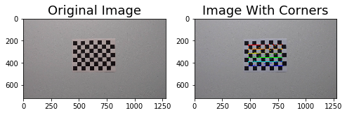

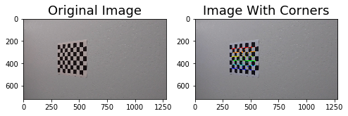

## Remove distortion from images
There are two main steps to this process: use chessboard images to obtain image points and object points, and then use the OpenCV functions cv2.calibrateCamera() and cv2.undistort() to remove distortion from highway driving images

If you look around the edges of both original and undistorted images, you will observe that distortion is removed from original images


[png](output_4_0.png)

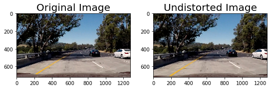


## Now lest perfrom the perspective transformation:

A perspective transform maps the points in a given image to different, desired, image points with a new perspective. The perspective transform you’ll be most interested in is a bird’s-eye view transform that let’s us view a lane from above; this will be useful for calculating the lane curvature later on. 

Here we apply a perspective transform, choosing four source points manually

src = np.float32([[490, 482],[810, 482],
                 [1300, 720],[40, 720]])
dst = np.float32([[0, 0], [1280, 0], 

I used cv2.getPerspectiveTransform() to get M, the transform matrix
M = cv2.getPerspectiveTransform(src, dst)

And the I used cv2.warpPerspective() to apply M and warp your image to a top-down view
warped = cv2.warpPerspective(undist, M, img_size)

```python
def birds_eye_view(img, display=True, read = True):
    if read:
        undist = undistort(img, show = False)
    else:
        undist = undistort(img, show = False, read=False) 
    img_size = (undist.shape[1], undist.shape[0])
    offset = 0
    src = np.float32([[490, 482],[810, 482],
                      [1300, 720],[40, 720]])
    dst = np.float32([[0, 0], [1280, 0], 
                     [1300, 720],[40, 720]])
    M = cv2.getPerspectiveTransform(src, dst)
    warped = cv2.warpPerspective(undist, M, img_size)
    if display:
        f, (ax1, ax2) = plt.subplots(1, 2, figsize=(9, 6))
        f.tight_layout()
        ax1.imshow(cv2.cvtColor(undist, cv2.COLOR_BGR2RGB))
        ax1.set_title('Undistorted Image', fontsize=20)
        ax2.imshow(cv2.cvtColor(warped, cv2.COLOR_BGR2RGB))
        ax2.set_title('Undistorted and Warped Image', fontsize=20)
        plt.subplots_adjust(left=0., right=1, top=0.9, bottom=0.)
    else:
        return warped, M

for image in glob.glob('test_images/test*.jpg'):
    birds_eye_view(image)
```


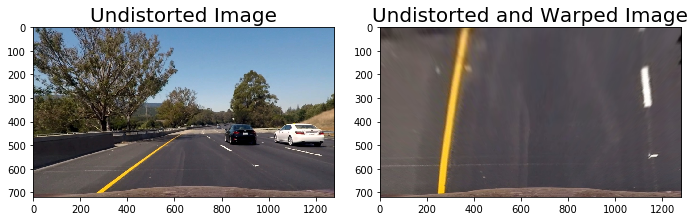

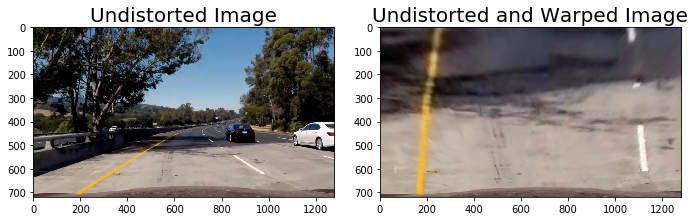


## Lets see what happend when we apply Binary Thresholds

Here we try to apply different color space and identify which provides better lane lines and ignore the onces which give some noise

Used S channel from HLS color space

Used L channel from LUV color space

Used B channel from Lab color space

Create combination binary threshold which best highlights lane lines


```python
def apply_thresholds(image, show=True):
    img, M = birds_eye_view(image, display = False)

    s_channel = cv2.cvtColor(img, cv2.COLOR_BGR2HLS)[:,:,2]
    l_channel = cv2.cvtColor(img, cv2.COLOR_BGR2LUV)[:,:,0]
    b_channel = cv2.cvtColor(img, cv2.COLOR_BGR2Lab)[:,:,2]   

    # Threshold color channel
    s_thresh_min = 185
    s_thresh_max = 255
    s_binary = np.zeros_like(s_channel)
    s_binary[(s_channel >= s_thresh_min) & (s_channel <= s_thresh_max)] = 1
    
    b_thresh_min = 150
    b_thresh_max = 200
    b_binary = np.zeros_like(b_channel)
    b_binary[(b_channel >= b_thresh_min) & (b_channel <= b_thresh_max)] = 1
    
    l_thresh_min = 225
    l_thresh_max = 255
    l_binary = np.zeros_like(l_channel)
    l_binary[(l_channel >= l_thresh_min) & (l_channel <= l_thresh_max)] = 1

    #color_binary = np.dstack((u_binary, s_binary, l_binary))
    
    combined_binary = np.zeros_like(s_binary)
    combined_binary[(l_binary == 1) | (b_binary == 1)] = 1

       
for image in glob.glob('test_images/test*.jpg'):
    apply_thresholds(image)
```


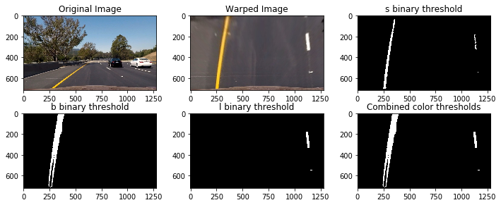

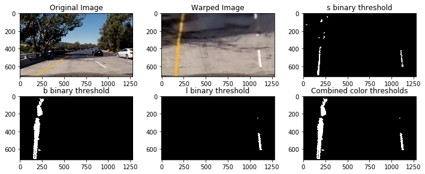

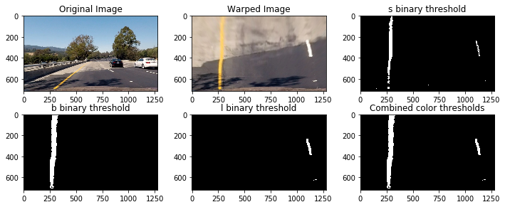


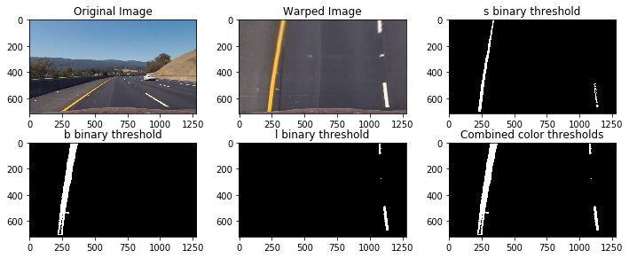

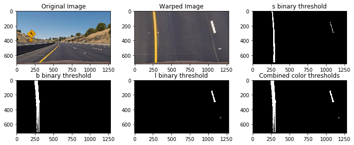


## After finding combination of the binary threshold which gives the best result, lets try to Fit a polynomial to the lane line and find vehicle position and Radius of Curvature

### I used following steps to achieve this:
#### Line Finding Method: Peaks in a Histogram and finding the non-zero pixels around peaks using numpy.nonzero()
#### Fit the polynomial to the lane numpy.polyfit()
#### For each lane line measure radius of curvature
```python
    
    
    ym_per_pix = 30/720 # meters per pixel in y dimension
    xm_per_pix = 3.7/700 # meteres per pixel in x dimension
    left_fit_cr = np.polyfit(lefty*ym_per_pix, leftx*xm_per_pix, 2)
    right_fit_cr = np.polyfit(righty*ym_per_pix, rightx*xm_per_pix, 2)
    left_curverad = ((1 + (2*left_fit_cr[0]*np.max(lefty) + left_fit_cr[1])**2)**1.5) \
                                 /np.absolute(2*left_fit_cr[0])
    right_curverad = ((1 + (2*right_fit_cr[0]*np.max(lefty) + right_fit_cr[1])**2)**1.5) \
                                    /np.absolute(2*right_fit_cr[0])
                                    
```        
#### Calculate the position of the vehicle
```python
    center = abs(640 - ((rightx_int+leftx_int)/2))
    
    offset = 0 
    img_size = (img.shape[1], img.shape[0])
    src = np.float32([[490, 482],[810, 482],
                      [1300, 720],[40, 720]])
    dst = np.float32([[0, 0], [1280, 0], 
                     [1300, 720],[40, 720]])
    Minv = cv2.getPerspectiveTransform(dst, src)
    
for image in glob.glob('test_images/test*.jpg'):
    fill_lane_lines(image)
    
```
I implemented this step in lines`fill_lane_lines()`.  Here is an example of my result on a test image:

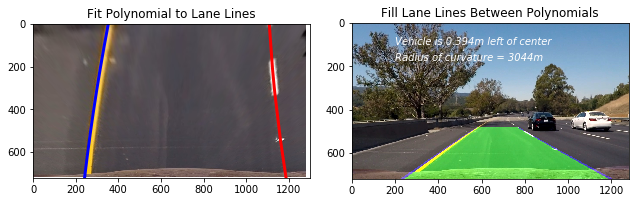

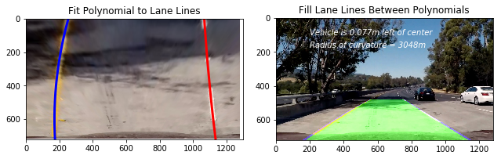


Now we have estimation of radius of curvature and position of the vehicle 


## Lets create function process_video() which will process video frame by frame:
We cobine all the above code blocks with all averaging and fallback concepts. *Process_video()* is the final pipeline: Cell #108, `P2 - Advance Lane Finding Project.ipynd`

Here is [link to my video result](https://www.youtube.com/watch?v=pbDZBV0_m4M) You will be redirected to YouTube. 

```python
Left = Line()
Right = Line()
video_output = 'result.mp4'
clip1 = VideoFileClip("project_video.mp4").subclip(0,5)
white_clip = clip1.fl_image(process_video) 
white_clip.write_videofile(video_output, audio=False)
```

## discussing problems / Issues I faced in implementation of this project

#### Gradient & Color Thresholding
* Time consuming experiment with gradient and color channnel thresholding.  
* In challenge video when car drives under the bridge it was difficult to find the lane lines
* Detecting lane lines in harder challenge was extremely hard as there were constant curves, fadeness, Shadow 

#### Bad Frames
* The challenge video has a section where the car goes underneath a tunnel and no lanes are detected
* To tackle this I had to resort to averaging over the well detected frames

##### Points of failure & Areas of Improvement
The pipeline seems to fail to detect lane lines for the harder challenge video due to frame rate, shahdow, sharp curves. 

#### Improvement:
I would take a smaller section to take the transform to take a better perspective transform
I would average over a smaller number of frames.

Additional option Challenge video: The pipeline did prity good job in detecting lane lines even though it having some hard time when car passed under a bridge or throught tunnel   
Here's the [link to my video Challenge output video](https://www.youtube.com/watch?v=xzmUQdYRtc0) You will be redirected to YouTube. 

```python
Left = Line()P2 - Advance Lane Finding Project

Right = Line()
challenge_output = 'challenge_video_output.mp4'
clip1 = VideoFileClip("challenge_video.mp4")
challenge_clip = clip1.fl_image(process_video) 
challenge_clip.write_videofile(challenge_output, audio=False)
```

  

